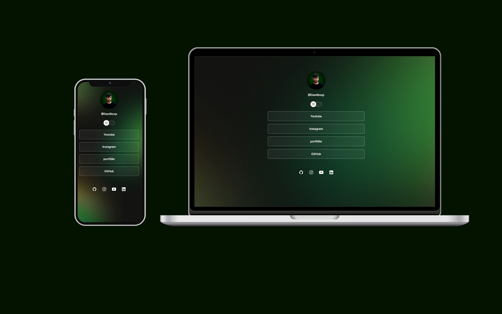

<h1 align="center">Danilo | links</h1>

  

  

## 💻 Projeto

O Danilo Links é um agregador de links para usar como cartão de visitas online.

- [Acesse o projeto](https://danilolinks.vercel.app/)

## 🚀 Tecnologias

Esse projeto foi desenvolvido com as seguintes tecnologias:

- HTML e CSS
- JavaScript
- Git e Github
- Figma
